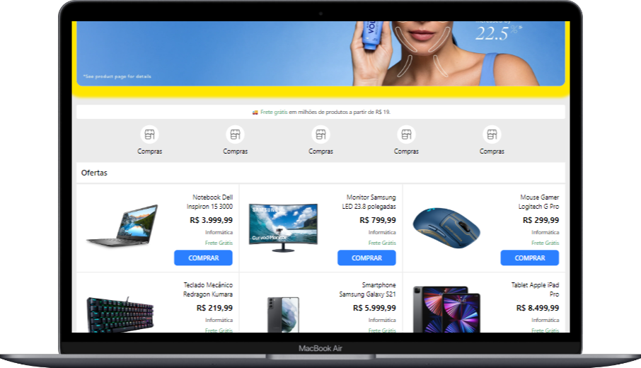

# E-commerce Layout

## 🚀 Projeto de site de e-commerce com layout inspirado no Mercado Livre para o curso de FrontEnd do Senai Jandira / SP.

## 🔧 Tecnologias usadas:

#### - HTML

#### - TailwindCSS

#### - JavaScript

#### 📱 Responsivo: funciona tanto no mobile quanto no desktop.

# ⚠️ Aviso Legal

### Este projeto tem caráter exclusivamente educacional. O nome, marca e identidade visual do Mercado Livre são de propriedade de seus respectivos detentores de direitos. Todos os direitos são reservados.

#

### Desktop

#

### Mobile

